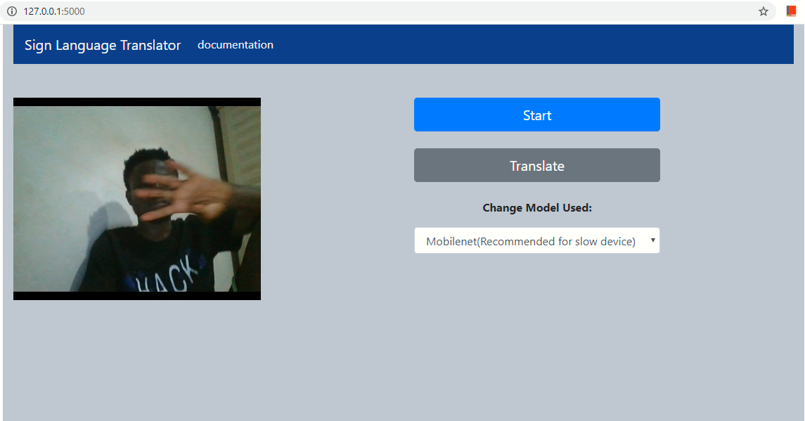

# Project_DHH

## Table of contents
* [Project Description](#project-description)
* [Getting Started](#getting-started)
* [prerequisites](#prerequisites)
* [Installing](#installing)
* [Deployment](#deployment)
* [Built With](#built-with)
* [Contributing](#contributing)
* [Versioning](#versioning)
* [Author(s)](#Author(s))
* [Acknowledgments](#acknowledgments)

## Project Description
This project implements an automatic sign language translation model to help people without hearing impairment to communicate better with the Deaf and Hard of Hearing (DHH) individuals. The model employs a 3D Recurrent Convolutional Neural network (3DRCNN) architecture to continously translates sign language communication to its equivalent English sentence. 
This project implements the following:
1. a neural network model for translation.
2. a data generation pipeline to generate dataset using youtube sign language videos and their transcriptions.
3. a webservice api to expose the predictive functionalities of the translation model.
4. a web application to consume the web service.

## Getting Started

These instructions will get you a copy of the project up and running on your local machine for development and testing purposes. See deployment for notes on how to deploy the project locally.

### Prerequisites

The packages needed to recreate the environment to run this project are in the requirements.txt.

```
Flask==1.1.1
h5py==2.10.0
Keras==2.3.1
opencv-python==3.3.0.9
pandas==0.24.2
tensorflow-cpu==1.15.0
```

### Installing

Create a virtual env, and run the following commands to get web application up and runnning

run this command to install all packages:
```
>> pip install -r requirements.txt
```

And then simply run these commands to start the local flask server
```
>>cd web_app
>>python app.py
```
This will open the web application where a user can record and translate sign language communication.


## Deployment

As far as deploying to a live server is concern, this project is not fully commplete. With the web application, the video streaming component was not implemented on the client-side, and therefore has to be moved to the client-side for live deployment. However, the client side streaming been implemented using angular to consume the webservice is incomplete since there was defficulties implementing a continous video streaming on the client-side using any popular client-side library.

## Built With

* [Keras](http://www.dropwizard.io/1.0.2/docs/) - Used for neural network implementation.
* [Maven](https://maven.apache.org/) - for
* [ROME](https://rometools.github.io/rome/) - Used to generate RSS Feeds

## Contributing

Please read [CONTRIBUTING.md](https://gist.github.com/PurpleBooth/b24679402957c63ec426) for details on our code of conduct, and the process for submitting pull requests to us.

## Versioning

We use [SemVer](http://semver.org/) for versioning. For the versions available, see the [tags on this repository](https://github.com/your/project/tags). 

## Author(s)

* **Samuel Atule** - *Initial work* - [PurpleBooth](https://github.com/PurpleBooth)

## License

This project is licensed under the MIT License - see the [LICENSE.md](LICENSE.md) file for details

## Acknowledgments

* Capstone Supervisor
* Ashesi CS Department
